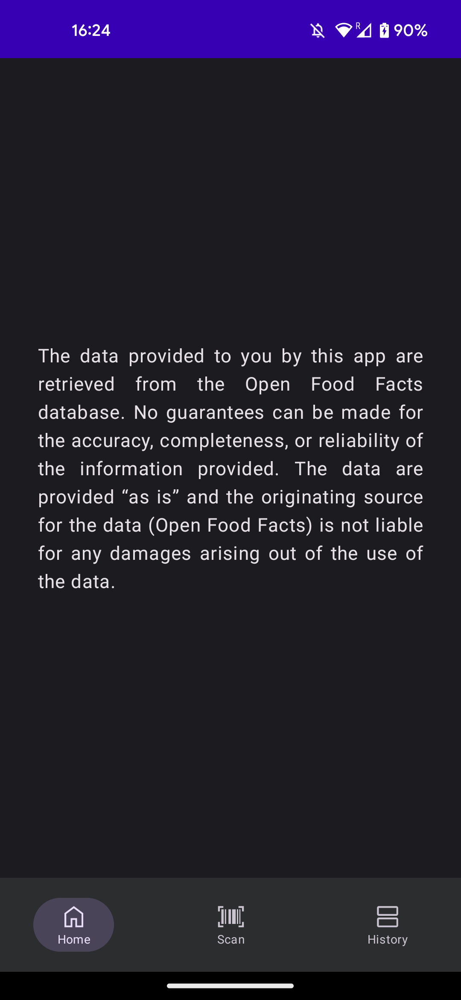
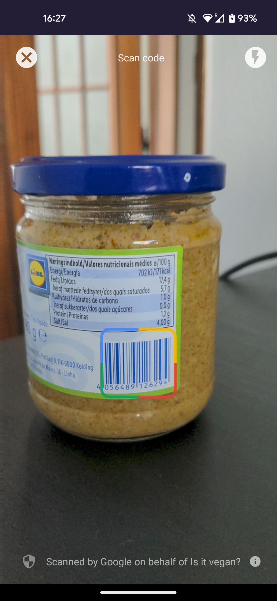
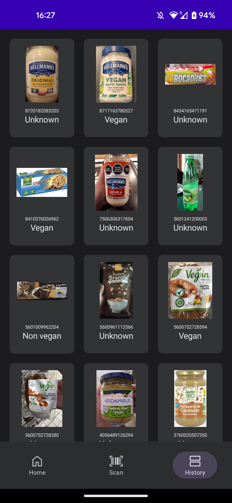

Is it vegan? App
==================

**Is it vegan?** is an application to help vegans to find out whether a food is vegan or not by scanning its barcode.

It is a **work in progress** 🚧

# Features

The app shows a label classification of a food which barcode was previously scanned through the **Scan** tab.

All scanned products are saved on a local database and displayed on the **History** tab.

## Screenshots

  

# Source

All the data provided are retrieved from the Open Food Facts database, a non-profit and collaborative project made by thousands of volunteers.

## API

Open Food Facts API: [https://openfoodfacts.github.io/api-documentation/](https://openfoodfacts.github.io/api-documentation/)

## Architecture

The chosen design pattern for this app was MVVM, following the [official architecture guidance](https://developer.android.com/topic/architecture) from Google.

This project applies techniques and best practices encouraged by Google for a Modern App Architecture development. They are:
- Use a single-activity application.
- Follow Unidirectional Data Flow (UDF).
- Use agnostic ViewModels of the Android lifecycle.
- Use Jetpack Compose.
- Use coroutines and flows.
- Exposed UI states as StateFlow.
- Use Hilt for dependency injection and scope to components.
- Naming conventions.
- Use a clearly defined data layer.
- Use a clearly defined UI layer.
- Use a domain layer.
- Unit test ViewModels and data layer entities.
- Prefer fakes to mocks.
- Test StateFlows.
- Instrumentation tests for Compose screens.

## Scanner

The Scanner was initially implemented using ML Kit (Google's Machine Learning) and CameraX, but after further investigation it was replaced by GmsBarcodeScanner, a client to open a code scanner powered by Google Play services.

Is it a complete and secure solution for scanning many types of barcodes without the need of requesting an extra permission - camera, in this case - for the user.

Delegating the image processing to Google Play services secure the user privacy by returning only the result to the app.

No results or images are stored by Google.

# Disclaimer

The data provided to you by this app are retrieved from the Open Food Facts database. No guarantees can be made for the accuracy, completeness, or reliability of the information provided. The data are provided “as is” and the originating source for the data (Open Food Facts) is not liable for any damages arising out of the use of the data.
